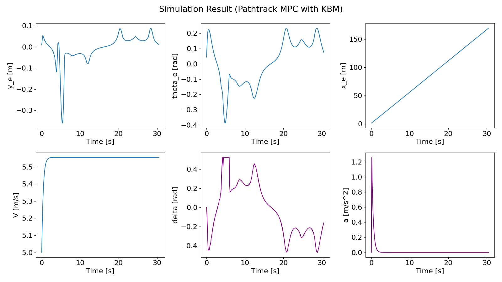
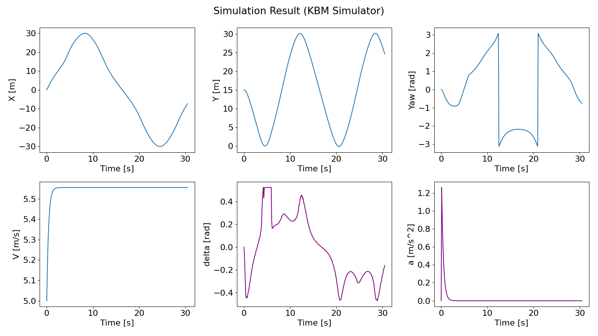

# MPC implementation with Python, solved by PANOC/IPOPT
This repository provides samples of Model Predictive Controller(MPC) implementation with python. 

The options of optimization solver is PANOC and IPOPT. 

Just change "solver_type" in simulation_setting.yaml as you like. 

## What is IPOPT?
It is a famous solver for a nonlinear optimization problem.
See [IPOPT official page](https://coin-or.github.io/Ipopt/) for detail.

## What is OpEn?
It is a numerical optimization solver written in Rust. The algorythm is called [PANOC](https://arxiv.org/abs/1709.06487)(Proximal Averaged Newton-type method for Optimal Control).

Following features are highlighted.
- Embeddable
- Accurate
- Fast
- User Friendly
- Community
- Documented

See [Official Page](https://alphaville.github.io/optimization-engine/) for detail.


## Simulation Results
### Simple Pathtrack with MPC, predicting vehicle behavior by Kinematic Bicycle Model.
#### SVG Animation

#### MPC log

#### Simulator log


## Environment costruction
Check latest information at [the official page](https://alphaville.github.io/optimization-engine/docs/installation).

### Install python, rust, and clang
- Install [Rust](https://www.rust-lang.org/tools/install)
- Install [Python](https://www.python.org/)
    - Use python 3.x
- Install [Clang](https://github.com/rust-lang/rust-bindgen/blob/master/book/src/requirements.md)

<!-- #### Especially for windows users who have [scoop](https://scoop.sh/), just run following commands.
- ```scoop install python```
- ```scoop install rustup``` -->

#### Install latest opengen
- ```git clone https://github.com/alphaville/optimization-engine.git```
- ```cd optimization-engine/open-codegen```
- ```python setup.py install```
- ```cd ..``` (move to optimization-engine/)
- ```cargo build```

#### Install other python packages
- ```pip install -r requirements.txt```

### How to run
```$ cd pympc_panoc_ipopt/pathtrack```
```$ python run_simulation.py```

## References
- [OpEn official HP](https://alphaville.github.io/optimization-engine/)
- [About installation of OpEn](https://alphaville.github.io/optimization-engine/docs/installation)
- [Python Examples of OpEn](https://alphaville.github.io/optimization-engine/docs/python-examples)
